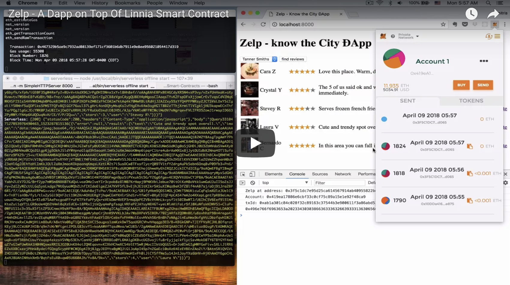

# Zelp

A primitive Yelp clone using [Linnia Smart Contract](https://github.com/ConsenSys/Linnia-Smart-Contracts/issues/18).


## Zelp Architecture


Zelp consists of 3 main components, highlighted with yellow in the diagram above.

* The first one is the zelp single-page app. This requires [MetaMask](https://metamask.io/) to run the web3 business logic in the browser. Just used jQuery for simpliciy. It's a few hundred lines.
* The second part is the `Zelp.sol` smart contract that runs in Ethereum. It has all the business logic that allows addition, purchase and rating of content.
* The final part, is an AWS lambda serverless application. This can be replaced with [Linnia Computation Mesh](https://github.com/ConsenSys/linnia-resources/blob/master/Technical-Whitepaper.md#7-data-computation) at some point. This application is run **by the content providers** and if the signed URLs requested are valid, it decrypts data stored in (fake-implementation for now) IPFS and it returns content to the app to present. Those users can review the code provided by the zelp framework and upload it in AWS by using 'serverless'.

```
serverless install -u https://github.com/lookfwd/zelp
```

## Demo

Watch the demo video [here](https://www.youtube.com/watch?v=HCEWzzKAGSY).

[](https://www.youtube.com/watch?v=HCEWzzKAGSY)


```
npm install -g serverless
npm install serverless-offline --save-dev
```
* Change the port to 8545 in `truffle-config.js`
* Start `ganache-cli`
* Login with MetaMask
* Deploy contracts: `truffle compile && truffle migrate`
* Go to [zelp-web](zelp-web) and run `python -m SimpleHTTPServer 8000` to start a web server
* Go to localhost:8000 to browse the `zelp` app
* For local deployment: `serverless offline start`

## Linnia changes that would enable deeper integration

* The extended use of `msg.sender` in Linnia, to identify who makes the change, doesn't scale well, when a single caller contract does the changes (in my case `MapDomain`). There could be a better way to register signatures for people and the ability for a single `Provider` to sign multiple times (ideally it would allow me to implement the state machine, I use `used` for). Also self-registered people (`Patients`) should have some `provenance` (see next).
* I would like to map the price to `irisScore`, but there's not fine-grained control of `provenance` yet.
* Accessing `FileRecord` values through `records`, is incomplete because of the mapping to tuple, the default getter does. Now I have to use `(patient, sigCount, irisScore, recordType, ipfsHash, timestamp) = hub.recordsContract().records(resourceId)` but this means that a) I lose `signatures`, which might be ok, but also b) if the order changes there might be a problem.
* I would like to map `endpoint` to some `userdata` in `FileRecord`. It could also be stored in `metadata` somehow.
* I now have my own `metadata` structure. Metadata (both Contextual and Quality) as described in [Data and Metadata](https://github.com/ConsenSys/linnia-resources/blob/master/Technical-Whitepaper.md#5-data-and-metadata) sound like exactly what I try to do with that data structure. If we were generalising to create a News Portal (see below) such metadata would be the taxonomy of the article as well as the teaser (thumbnail and first few lines of the text).

Note that the theme here is, in general, generic web content "gating" by using single-use URLs that consume credits as you browse. It's easy to adapt the code of Zelp to create e.g. **news portals or forums**, where the visitor adds Ether and then browses the metadata (teaser) of the content and has to make micro-payments to access gated content. Further roles and access control (by mapping and extending the Patient/Provider roels) can enable/disable and rate content as e.g. Editors, moderators etc.


## To deploy

This is intented to be a demo-only application for now. It requires work on IPFS and more. Nevertherless, here are some notes on deployment. A user has to populate `evn.yml` in the [serverless](serverless) directory with the private key for IPFS, the Ethereum address of the zelp contract and the url of a web3 provider:

```
ZELP_KEY: 'the-key'
ZELP_ADDRESS: '0x31...'
ZELP_WEB3_PROVIDER: 'ws://localhost:8545'
```