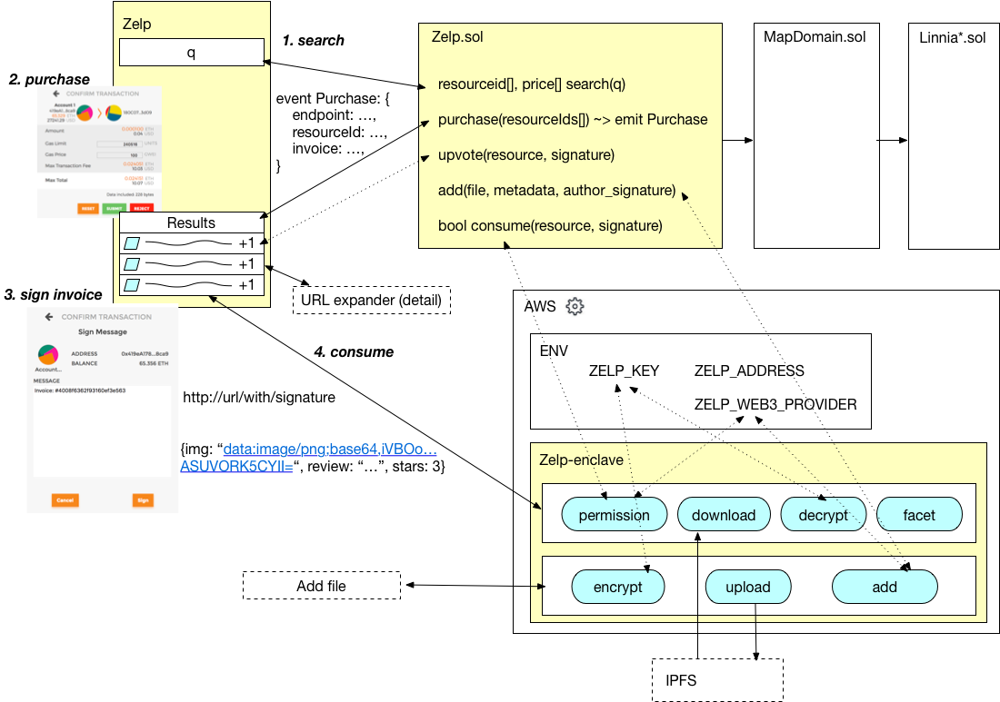

# Zelp

A primitive Yelp clone using [Linnia Smart Contract](https://github.com/ConsenSys/Linnia-Smart-Contracts/issues/18).


## Zelp Architecture



Zelp consists of 3 main components, highlighted with yellow in the diagram above.

* The first one is the zelp single-page app. This requires [MetaMask](https://metamask.io/) to run the web3 business logic in the browser. Just used jQuery for simpliciy. It's a few hundred lines.
* The second part is the `Zelp.sol` smart contract that runs in Ethereum. It has all the business logic that allows addition, purchase and rating of content.
* The final part, is an AWS lambda serverless application. This can be replaced with [Linnia Computation Mesh](https://github.com/ConsenSys/linnia-resources/blob/master/Technical-Whitepaper.md#7-data-computation) at some point. This application is run **by the content providers** and if the signed URLs requested are valid, it decrypts data stored in (fake-implementation for now) IPFS and it returns content to the app to present. Those users can review the code provided by the zelp framework and upload it in AWS by using 'serverless'.

```
serverless install -u https://github.com/lookfwd/zelp
```

## Demo


```
npm install -g serverless
npm install serverless-offline --save-dev
```
* Change the port to 8545 in `truffle-config.js`
* Start `ganache-cli`
* Login with MetaMask
* Deploy contracts: `truffle compile && truffle migrate`
* Go to [zelp-web](zelp-web) and run `python -m SimpleHTTPServer 8000` to start a web server
* Go to localhost:8000 to browse the `zelp` app
* For local deployment: `serverless offline start`

## To deploy

This is intented to be a demo-only application for now. It requires work on IPFS and more. Nevertherless, here are some notes on deployment. A user has to populate `evn.yml` in the [serverless](serverless) directory with the private key for IPFS, the Ethereum address of the zelp contract and the url of a web3 provider:

```
ZELP_KEY: 'the-key'
ZELP_ADDRESS: '0x31...'
ZELP_WEB3_PROVIDER: 'ws://localhost:8545'
```