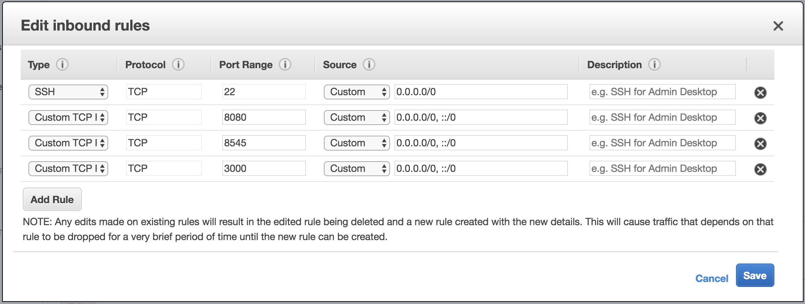

# Zelp

A primitive Yelp clone using [Linnia Smart Contract](https://github.com/ConsenSys/Linnia-Smart-Contracts/issues/18).


## Zelp Architecture


Zelp consists of 3 main components, highlighted with yellow in the diagram above.

* The first one is the zelp single-page app. This requires [MetaMask](https://metamask.io/) to run the web3 business logic in the browser. Just used jQuery for simpliciy. It's a few hundred lines.
* The second part is the `Zelp.sol` smart contract that runs in Ethereum. It has all the business logic that allows addition, purchase and rating of content.
* The final part, is an AWS lambda serverless application. This can be replaced with [Linnia Computation Mesh](https://github.com/ConsenSys/linnia-resources/blob/master/Technical-Whitepaper.md#7-data-computation) at some point. This application is run **by the content providers** and if the signed URLs requested are valid, it decrypts data stored in (fake-implementation for now) IPFS and it returns content to the app to present. Those users can review the code provided by the zelp framework and upload it in AWS by using 'serverless'.

```
serverless install -u https://github.com/lookfwd/zelp
```

## Demo

Watch the demo video [here](https://www.youtube.com/watch?v=HCEWzzKAGSY).

[](https://www.youtube.com/watch?v=HCEWzzKAGSY)

## How to run

](https://www.youtube.com/watch?v=f6seFW19eU4)

To run the demo you will need three consoles. I will also assume a clean new instance of an EC2 server:

```
Ubuntu Server 16.04 LTS (HVM), SSD Volume Type
Type        vCPUs   Memory (GiB)
t2.medium   2       4
```

Highly likely your dev environment will be more powerful than that. You have to note down the IP address of your EC2 server. Below we will assume it's `34.238.28.80`. For your local dev machine, `localhost` will work.

You will have to open a few ports on EC2 firewall for incoming connections. Those are: `8080`, `8545` and `3000`.



We should then, be ready to start.

### On the 1st console

First let's install some essential software:

```
git clone https://github.com/lookfwd/zelp.git
cd zelp
sudo apt-get update
sudo apt-get install npm
sudo npm cache clean -f
sudo npm install -g n
sudo n stable
sudo npm install -g truffle ganache-cli serverless
```

Then we install the requirements for the serverless component of the application:

```
cd serverless

npm install serverless-offline --save-dev
npm install ethereumjs-util url-expand web3
```

Finally, we go to [bit.ly](https://bitly.com/) and create a short url for `http://<MY IP>:3000/load/` e.g. `http://34.238.28.80:3000/load/`. The reason we do this, is that the URL of your real AWS Lambda function is likely going to be quite long. It's way easier and cheaper to store in Ethereum, strings up to 32 characters. That's why we use shortened URLs.

We will replace all the instances of the short URL in `default_records.json` e.g.

```
$ perl -pi -e 's/https:\/\/goo.gl\/L9oDYV/https:\/\/bit.ly\/2HiPHVE/' default_records.json
```

Note that `default_records.json` is used by both the serverless part and the contract migration code (in [Linnia-Smart-Contracts](Linnia-Smart-Contracts/migrations/2_deploy_contracts.js) at the moment. This URL part is stored in the blockchain.

We can do a quick diff with `git diff .` to ensure that the URL changes are the only changes we've done.

We can now start the serverless component offline:

```
serverless offline start --host 0.0.0.0
```

### On the 2nd console

In the second console we deploy the smart contract. We do:

```
cd Linnia-Smart-Contracts
ganache-cli --rpcaddr 0.0.0.0 &
```

Now we should be able to connect with MetaMask to `http://34.238.28.80:8545/`. We can log-out (if we were logged in) and use the passphrase from console to restore the main account (should have about Ξ 100).

Now we can install some dependencies:

```
npm install babel-polyfill zeppelin-solidity
```

And finally compile and migrate the contract:

```
truffle compile && truffle migrate
```

### On the 3rd console

We are now ready to run the web application.

```
cd web/
```

The URL expander also runs on the serverless component (for now) so we have to change the (hardcoded for now) URL in [index.html](web/index.html). This should have the form `http://<MY IP>:3000/expand/` e.g. `http://34.238.28.80:3000/expand/`. We can do the replace:

```
perl -pi -e 's/http:\/\/localhost:3000\/expand/http:\/\/34.238.28.80:3000\/expand/' index.html
```

We can do a quick diff with `git diff .` to ensure that the URL changes are the only changes we've done.

Now we can start a python web server to deliver the html pages: 

```
python -m SimpleHTTPServer 8080
```

Now we can browse to the main url, `http://<MY IP>:8080` e.g. `http://34.238.28.80:8080` and Zelp's main page should load short after.


## Linnia changes that would enable deeper integration

* The extended use of `msg.sender` in Linnia, to identify who makes the change, doesn't scale well, when a single caller contract does the changes (in my case `MapDomain`). There could be a better way to register signatures for people and the ability for a single `Provider` to sign multiple times (ideally it would allow me to implement the state machine, I use `used` for). Also self-registered people (`Patients`) should have some `provenance` (see next).
* I would like to map the price to `irisScore`, but there's not fine-grained control of `provenance` yet.
* Accessing `FileRecord` values through `records`, is incomplete because of the mapping to tuple, the default getter does. Now I have to use `(patient, sigCount, irisScore, recordType, ipfsHash, timestamp) = hub.recordsContract().records(resourceId)` but this means that a) I lose `signatures`, which might be ok, but also b) if the order changes there might be a problem.
* I would like to map `endpoint` to some `userdata` in `FileRecord`. It could also be stored in `metadata` somehow.
* I now have my own `metadata` structure. Metadata (both Contextual and Quality) as described in [Data and Metadata](https://github.com/ConsenSys/linnia-resources/blob/master/Technical-Whitepaper.md#5-data-and-metadata) sound like exactly what I try to do with that data structure. If we were generalising to create a News Portal (see below) such metadata would be the taxonomy of the article as well as the teaser (thumbnail and first few lines of the text).

Note that the theme here is, in general, generic web content "gating" by using single-use URLs that consume credits as you browse. It's easy to adapt the code of Zelp to create e.g. **news portals or forums**, where the visitor adds Ether and then browses the metadata (teaser) of the content and has to make micro-payments to access gated content. Further roles and access control (by mapping and extending the Patient/Provider roels) can enable/disable and rate content as e.g. Editors, moderators etc.

## Ecosystem changes

* I think there's something wrong with `MeataMask`'s `web3.personal.sign()` feature. When I put as much info as I want and `sha3` it as a first argument, the warning message shows garbage. When I give a nice message, I can put very little info in it and I have to reconstruct it in Solidity (expensive) to do `ecrecover`. There mus be a better solution.
* In order to enable this use case, we need much faster (sub-second) contract processing times and 1000x times smaller fees. Right now fees for contract execution are many times larger than the payments. The system now would be suitable for expensive content e.g. scientific papers.

## To deploy

This is intented to be a demo-only application for now. It requires work on IPFS and more. Nevertherless, here are some notes on deployment. A user has to populate `evn.yml` in the [serverless](serverless) directory with the private key for IPFS, the Ethereum address of the zelp contract and the url of a web3 provider:

```
ZELP_KEY: 'the-key'
ZELP_ADDRESS: '0x31...'
ZELP_WEB3_PROVIDER: 'ws://localhost:8545'
```
